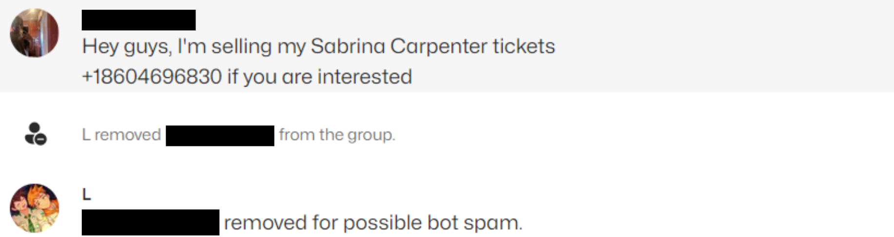

# GroupMe-Anti-Spam
## Usage
You will need a token from GroupMe through which the script will access your data. You can get this token after you log in to https://dev.groupme.com (using your normal GroupMe credentials). The token is accessible by clicking **Access token** in the header. Enter this token in the first line of the code.\

In `groups.txt` enter in the line separated IDs of all groups you want to be monitored. THe IDs can be accessed as the string of integers a group invite link (eg: `https://groupme.com/join_group/XXXXXXXXX/...`).\

`blacklist.txt` contains the line separated words or phrases that will trigger the bot to detect messages as bot spam. When separating multiple triggers in the same line with vertical line space characters, the bot will only ban a user if they send a message containing all of the triggers in the line (eg: `SABRINA CARPENTER | TICKET`). Capitalization does not matter.

## Functions
If a message contains the trigger(s) specified on a line in `blacklist.txt`, the bot will ban the user as demonstrated below

</img>

### Commands
*`-ping` will return a message if the bot is online.
*`-setup` followed by a valid group invite link will add the bot to the group (if it has not previously been removed from it) and add its ID to `groups.txt`.
*`-purge` views all previous messages in a group and bans any current members who previously sent messages detected as spam.
